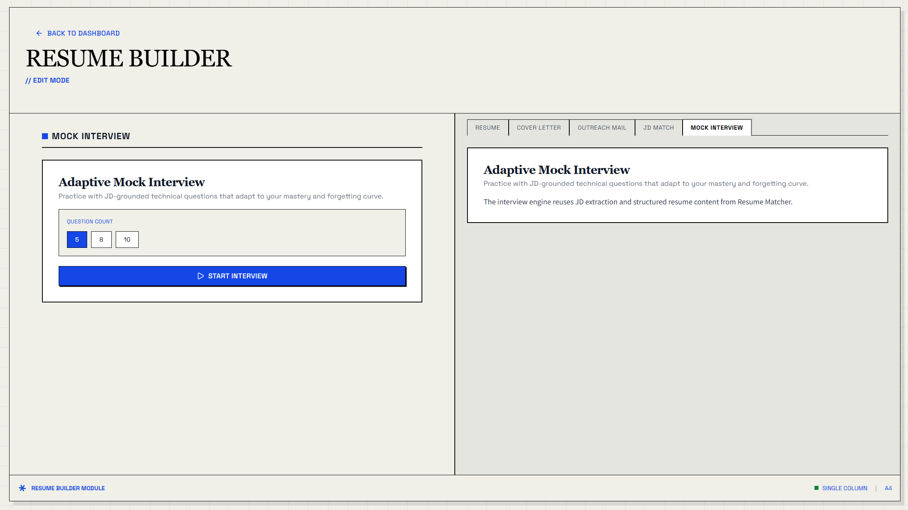

# Adaptive Mock Interview

Adaptive Mock Interview is a full-stack extension for Resume Matcher that turns job descriptions and structured resume data into a personalized interview practice workflow.



## Overview

Most resume tools stop at document optimization. This project extends Resume Matcher beyond resume tailoring by adding an adaptive mock interview system that:

- generates technical interview questions grounded in both the JD and the candidate's resume
- tracks response time, correctness, and topic history with SQLite
- adapts the next question difficulty using mastery and forgetting-curve signals

## Key Features

- JD-aware question generation using existing Resume Matcher job analysis
- resume-aware interviewing based on parsed resume structure and candidate experience
- LangGraph-based interviewer agent for question orchestration
- SQLite-backed session and attempt history
- scikit-learn difficulty recommendation based on historical interaction data
- integrated builder-tab experience inside the existing Resume Matcher frontend

## How It Works

1. User opens the Mock Interview tab from the Resume Builder.
2. Backend resolves the linked resume and job description context.
3. Existing JD analysis extracts required skills and responsibilities.
4. The interviewer agent generates a multiple-choice technical question.
5. SQLite stores the session, question metadata, answer time, and correctness.
6. The predictor recommends the next difficulty level.
7. Frontend updates feedback, progress, and the next adaptive question.

## Project Structure

```text
Resume-Matcher/
- adaptive_mock_interview/
  - README.md
- apps/backend/app/adaptive_mock_interview/
  - README.md
  - context.py
  - llm_engine.py
  - predictor.py
  - service.py
  - database/sqlite_store.py
- apps/backend/app/routers/mock_interview.py
- apps/backend/app/schemas/mock_interview.py
- apps/frontend/components/builder/mock-interview-panel.tsx
- apps/frontend/hooks/use-adaptive-mock-interview.ts
- apps/frontend/lib/api/mock-interview.ts
```

## Architecture

### Frontend

- Adds a dedicated `Mock Interview` tab to the Resume Builder
- Restores active interview sessions from browser session storage
- Displays adaptive feedback, answer history, and mastery indicators

### Backend

- Exposes session creation, answer submission, and session recovery endpoints
- Reuses Resume Matcher resume parsing and JD extraction capabilities
- Coordinates LangGraph question generation and adaptive difficulty prediction

### Persistence and Adaptation

- TinyDB remains the system of record for resumes and jobs
- SQLite is isolated for interview telemetry and adaptive practice history
- scikit-learn uses prior attempts to recommend the next question difficulty

## Related Implementation Docs

For backend-module details, see:

- `apps/backend/app/adaptive_mock_interview/README.md`
